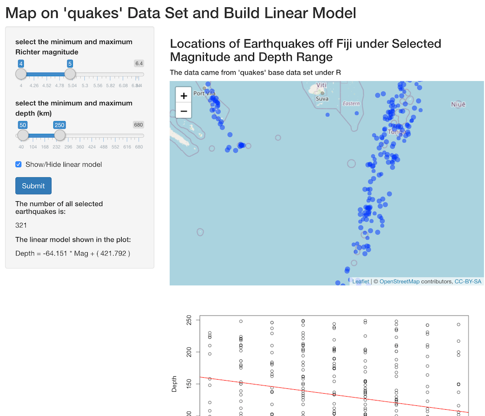

```{r setup, include=FALSE}
knitr::opts_chunk$set(echo = TRUE)
```

## Overview

This Shiny application along with the Slidify presentation is created for Coursera course Developing Data Products under the Data Science track.  

The data set involved is the "quakes" base data set under R, which gives the locations of 1000 seismic events of MB > 4.0. The events occurred in a cube near Fiji since 1964.

```{r echo=TRUE}
data("quakes"); head(quakes, 3)
```

## Shiny Application

The [Shiny application](https://xinyuw.shinyapps.io/quakesApp/) generated from the "quakes" data set aims to do the followings:

1. People can manually select the magnitude and depth ranges of the earthquakes;
2. the app can locate the selected earthquakes occurred on map;
3. the app will then calculate and plot:
  * the counts of selected earthquakes
  * the relationship between magnitude and depth
  * the linear model between those two variables

## Example

The app can be easily interactive with users. After pulling the ranges of the sliders and click submit, the map, plot and linear model will be automatically generated.

```{r echo=FALSE}

```


## Conclusion

The map makes the data visually better, and the sliders give flexibility to users to look into specific ranges of magnitude and depth. The plot can also gives a summary of the distribution of magnitude versus depth. Although the linear model is not perfectly matched to all the data, but still it gives a trend.  

All codes, including the presentation and application, can be found on [github link](https://github.com/XinyuW-hub/Developing-Data-Product)
